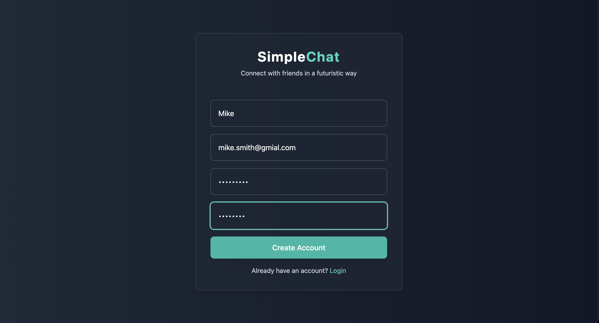
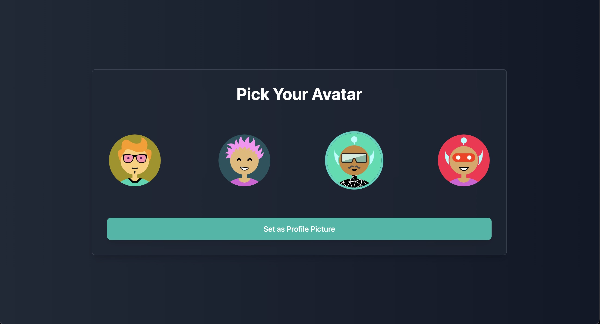
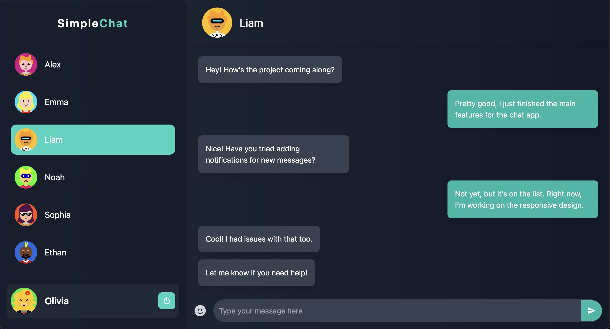

# Simple Chat App

A secure, encrypted communication and collaboration application built with React, Node.js, Socket.IO, and MongoDB, designed for secure messaging between two parties who have not met to exchange keys. This application supports PKI-based authentication, ensuring secure identity verification through RSA key pairs, without requiring participants to exchange keys beforehand.

Features
End-to-End Encryption: Messages are encrypted between two parties using RSA encryption, ensuring that only the recipient can decrypt the messages.

User Authentication: PKI-based authentication to verify user identities, leveraging SSL certificates for secure communication.

Real-time Messaging: Instant message exchange between users using Socket.IO, with encryption applied to all messages.

Responsive Design: Optimized for use on phones, tablets, and desktops, with a user-friendly interface.

User Avatars: Users can select an avatar during registration for a personalized experience.

Mobile-Friendly: Optimized for mobile devices, featuring a responsive contacts sidebar and chat interface.

Dark Futuristic Theme: Modern and sleek UI design with dark mode aesthetics.

## Screenshots

Here are a few screenshots of the app in action:

### For desktop:

- **Registration Page**: 
- **Avatar Selection**: 
- **Chat Interface**: 

## Tech Stack

- **Frontend:** React, TailwindCSS
- **Backend:** Node.js, Express
- **Database:** MongoDB (with Mongoose for database interactions)
- **Real-time Messaging:** Socket.IO

## Setup Instructions

1. Clone this repository: https://github.com/dennyking24/chatapp
   ```bash
   ```
1. Navigate to the project directory:

   ```bash
   cd simple-chat
   ```

2. Install the dependencies for both the server and client:

   - Server:

     ```bash
     cd server
     yarn
     ```

   - Client:
     ```bash
     cd client
     yarn
     ```

3. Create a `.env` file in the `server` directory and add the following:

   ```bash
   PORT=5000
   MONGO_URI=your_mongodb_connection_string
   ```

4. Start the development servers:

   - Server:

     ```bash
     cd server
     nodemon index.js
     ```

   - Client:
     ```bash
     cd client
     yarn dev
     ```

5. Open the app in your browser at `http://localhost:5173`.

6. Enjoy.
